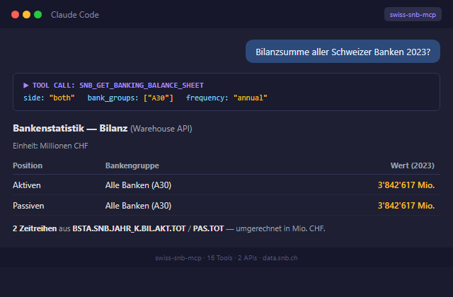

> 🇨🇭 **Part of the [Swiss Public Data MCP Portfolio](https://github.com/malkreide)**

# 🏦 swiss-snb-mcp


[](https://opensource.org/licenses/MIT)
[](https://www.python.org/downloads/)
[](https://modelcontextprotocol.io/)
[](https://data.snb.ch)


> MCP server for the Swiss National Bank (SNB) data portal — exchange rates, balance sheet, interest rates, SARON, monetary aggregates, banking statistics, and balance of payments.

[🇩🇪 Deutsche Version](README.de.md)

<p align="center">
  
</p>

---

## Overview

`swiss-snb-mcp` connects AI models to the official Swiss National Bank data portal at [data.snb.ch](https://data.snb.ch) via the Model Context Protocol (MCP). It provides structured access to SNB's public REST API — no authentication required.

The server covers three tiers of datasets, all confirmed against the live API:

**Phase 1 — Dedicated tools:**
- **Exchange rates** (monthly averages, month-end rates, annual averages) for 27 currencies against CHF
- **SNB balance sheet** (Bilanz): gold reserves, foreign exchange investments, banknotes in circulation, sight deposits, and totals

**Phase 2 — Via generic cube tools (`snb_get_cube_data` + `snb_get_cube_metadata`):**
- **SNB policy rate (Leitzins) and SARON** daily fixing, emergency facility rate, sight deposit rates
- **SARON compound rates**: Overnight, 1M, 3M, 6M
- **International money market rates**: SARON (CH), SOFR (USA), TONA (JP), SONIA (UK), €STR/EURIBOR (EZ)
- **Official central bank rates**: SNB, Fed, ECB, Bank of England, Bank of Japan
- **Monetary aggregates M1, M2, M3**: stock levels and year-on-year changes

**Phase 3 — Warehouse API (banking statistics) and balance of payments:**
- **Banking balance sheets** (BSTA BIL): total assets and liabilities by bank group — annual and monthly
- **Banking income statements** (BSTA EFR): operating income, expenses, taxes by bank group — annual
- **Balance of payments**: current account, capital account, financial account (quarterly)
- **International investment position**: components by investment type (quarterly)
- **Generic warehouse access**: raw access to any SNB Warehouse cube by ID

**Anchor demo query:** *"What was the EUR/CHF exchange rate during the 2015 Franc shock, and where does the SNB policy rate stand today compared to the Fed and ECB?"*

---

## Features

- 💱 **Exchange rates** — monthly CHF rates for EUR, USD, JPY, GBP, CNY and 22 more currencies
- 📅 **Annual averages** — year-by-year rates from 1980 onwards
- 🏛️ **SNB balance sheet** — gold, foreign exchange investments, banknotes, sight deposits (monthly)
- 🔄 **Currency conversion** — convert any amount to CHF using official SNB rates
- 📈 **Policy rate & SARON** — daily fixing, Leitzins, compound rates (1M/3M/6M)
- 🌍 **International rate comparison** — SNB, Fed, ECB, Bank of England, Bank of Japan side by side
- 💰 **Monetary aggregates** — M1, M2, M3 stock levels and year-on-year growth
- 🏦 **Banking statistics** — balance sheets and income statements by bank group (12 groups)
- 📊 **Balance of payments** — current account, IIP, and international investment position
- 🔍 **Generic cube access** — query any SNB data cube or Warehouse cube by ID
- 🔓 **No authentication required** — fully public SNB data portal

---

## Prerequisites

- Python 3.11+
- `uv` or `pip`
- MCP-compatible client (Claude Desktop, Claude Code, or any MCP host)

---

## Installation

**Via uvx (recommended — no permanent installation needed):**

```bash
uvx swiss-snb-mcp
```

**Via pip:**

```bash
pip install swiss-snb-mcp
```

**From source:**

```bash
git clone https://github.com/malkreide/swiss-snb-mcp.git
cd swiss-snb-mcp
pip install -e .
```

---

## Usage / Quickstart

**Claude Desktop — add to `claude_desktop_config.json`:**

```json
{
  "mcpServers": {
    "swiss-snb-mcp": {
      "command": "uvx",
      "args": ["swiss-snb-mcp"]
    }
  }
}
```

**Config file locations:**
- macOS: `~/Library/Application Support/Claude/claude_desktop_config.json`
- Windows: `%APPDATA%\Claude\claude_desktop_config.json`

Try it immediately in Claude Desktop:

> *"What is the current EUR/CHF exchange rate according to the SNB?"*
> *"Show me the SNB balance sheet for the last 12 months — gold and foreign reserves."*

---

## Configuration

No API key or authentication required. The SNB data portal is fully public.

**Optional environment variable:**

| Variable | Default | Description |
|---|---|---|
| `SNB_TIMEOUT` | `15` | HTTP request timeout in seconds |

---

## Available Tools

### Phase 1 — Dedicated Tools

| Tool | Description |
|---|---|
| `snb_get_exchange_rates` | Monthly CHF rates for EUR, USD, JPY, GBP, CNY and 22 more currencies |
| `snb_get_annual_exchange_rates` | Annual average rates, data from 1980 |
| `snb_get_balance_sheet` | SNB Bilanz positions in millions CHF (monthly) |
| `snb_convert_currency` | Convert any amount to CHF using official SNB rates |
| `snb_list_currencies` | List all 27 currency IDs with labels and units |
| `snb_list_balance_sheet_positions` | List all asset and liability position IDs |

### Phase 2 — Generic Cube Tools

| Tool | Description |
|---|---|
| `snb_get_cube_data` | Generic access to any SNB cube by ID |
| `snb_get_cube_metadata` | Inspect dimensions and filter values of any cube |
| `snb_list_known_cubes` | Overview of all 10 verified cubes (Phase 1–3) and discovery guide |

### Phase 3 — Warehouse API (Banking Statistics) and Balance of Payments

| Tool | Description |
|---|---|
| `snb_get_banking_balance_sheet` | Banking balance sheets by bank group (monthly/annual, assets/liabilities) |
| `snb_get_banking_income` | Banking income statements by bank group (annual) |
| `snb_get_balance_of_payments` | Balance of payments and international investment position (quarterly) |
| `snb_get_warehouse_data` | Generic access to any SNB Warehouse cube by ID |
| `snb_get_warehouse_metadata` | Inspect dimensions and last update of a Warehouse cube |
| `snb_list_warehouse_cubes` | Overview of available Warehouse cube IDs (BSTA) |
| `snb_list_bank_groups` | List all 12 bank group IDs with labels |

### Example Use Cases

| Query | Tool |
|---|---|
| *"What is the current EUR/CHF rate?"* | `snb_get_exchange_rates` |
| *"Convert CHF 10,000 to USD"* | `snb_convert_currency` |
| *"Show SNB gold reserves over the last year"* | `snb_get_balance_sheet` |
| *"What is the current SNB policy rate?"* | `snb_get_cube_data` (cube: `snbgwdzid`) |
| *"How do SNB, Fed and ECB rates compare?"* | `snb_get_cube_data` (cube: `snboffzisa`) |
| *"What is the SARON 3M compound rate?"* | `snb_get_cube_data` (cube: `zirepo`) |
| *"How fast is M3 money supply growing?"* | `snb_get_cube_data` (cube: `snbmonagg`) |
| *"Total assets of all Swiss banks?"* | `snb_get_banking_balance_sheet` |
| *"Income statement of cantonal banks?"* | `snb_get_banking_income` (bank_group: `G10`) |
| *"Switzerland's balance of payments?"* | `snb_get_balance_of_payments` |
| *"Which cubes are available?"* | `snb_list_known_cubes` |

---

## Safety & Limits

| Aspect | Details |
|--------|---------|
| **Access** | Read-only (`readOnlyHint: true`) — the server cannot modify or delete any data |
| **Personal data** | No personal data — all sources are aggregated, public macroeconomic statistics |
| **Rate limits** | SNB Warehouse API has WAF protection (HTTP 503 after ~100 rapid requests); the server retries automatically with exponential backoff (max 3 retries, delays 2/4/8s) |
| **Timeout** | 15 seconds per API call |
| **Authentication** | No API keys required — both APIs (`/api/cube/` and `/api/warehouse/cube/`) are publicly accessible |
| **Data source** | [Swiss National Bank — data.snb.ch](https://data.snb.ch) |
| **Terms of Service** | Subject to SNB's [Terms of Use](https://www.snb.ch/en/the-snb/mandates-goals/legal-framework/terms-of-use) and [Copyright](https://www.snb.ch/en/the-snb/mandates-goals/legal-framework/copyright); data is free for non-commercial use with source attribution |

---

## Architecture

```
┌─────────────────┐     ┌───────────────────────────┐     ┌──────────────────────┐
│   Claude / AI   │────▶│     Swiss SNB MCP         │────▶│     data.snb.ch      │
│   (MCP Host)    │◀────│     (MCP Server)          │◀────│                      │
└─────────────────┘     │                           │     │  /api/cube/ (JSON)   │
                        │  16 Tools                 │     │  /api/warehouse/     │
                        │  Stdio | SSE              │     │  Public · No Auth    │
                        │                           │     │                      │
                        │  Phase 1: dedicated tools │     │  Exchange rates      │
                        │  Phase 2: generic cubes   │     │  Balance sheet       │
                        │  Phase 3: warehouse +     │     │  Interest rates      │
                        │           banking stats   │     │  Banking statistics  │
                        └───────────────────────────┘     │  Balance of payments │
                                                          └──────────────────────┘
```

### Cube Discovery Pattern

The SNB API follows a consistent cube-based structure. Use `snb_list_known_cubes` to explore verified cube IDs, then `snb_get_cube_metadata` to inspect dimensions before querying with `snb_get_cube_data`. Phase 3 adds the Warehouse API (`/api/warehouse/cube/`) for granular banking statistics — use `snb_list_warehouse_cubes` and `snb_list_bank_groups` as starting points.

---

## Project Structure

```
swiss-snb-mcp/
├── src/
│   └── swiss_snb_mcp/
│       ├── __init__.py
│       ├── server.py       # Core tools and FastMCP server (Phase 1–2 + BoP)
│       └── warehouse.py    # Warehouse API tools (Phase 3: banking statistics)
├── tests/
│   ├── test_scenarios.py           # 20 tests for Phase 1–2
│   └── test_warehouse_scenarios.py # 20 tests for Phase 3
├── pyproject.toml          # Build configuration (hatchling)
├── CHANGELOG.md
├── CONTRIBUTING.md
├── LICENSE
├── README.md               # This file (English)
└── README.de.md            # German version
```

---

## Known Limitations

- **Exchange rates:** Monthly averages only — no intraday or daily rates available via this API
- **Balance sheet:** Monthly data; some positions may have a publication lag of 1–2 months
- **Cube access:** Cube IDs are not officially documented by the SNB — use `snb_list_known_cubes` for verified IDs
- **Historical depth:** Coverage varies by series; exchange rates go back to 1980, some interest rate series start later
- **No forecasts:** All data is historical/realised — SNB does not publish forecasts via this API

---

## Testing

```bash
# Unit tests (no API key required)
PYTHONPATH=src pytest tests/ -m "not live"

# Integration tests (live SNB API)
PYTHONPATH=src pytest tests/ -m "live"
```

---

## Changelog

See [CHANGELOG.md](CHANGELOG.md)

---

## Contributing

See [CONTRIBUTING.md](CONTRIBUTING.md) for guidelines on reporting issues, suggesting new SNB cube IDs, and contributing code.

---

## License

MIT License — see [LICENSE](LICENSE)

---

## Author

Hayal Oezkan · [github.com/malkreide](https://github.com/malkreide)

---

## Credits & Related Projects

- **Data:** [Swiss National Bank](https://data.snb.ch) — SNB data portal (public REST API)
- **Protocol:** [Model Context Protocol](https://modelcontextprotocol.io/) — Anthropic / Linux Foundation
- **Related:** [zurich-opendata-mcp](https://github.com/malkreide/zurich-opendata-mcp) — MCP server for Zurich city open data
- **Related:** [swiss-transport-mcp](https://github.com/malkreide/swiss-transport-mcp) — Swiss public transport MCP server
- **Portfolio:** [Swiss Public Data MCP Portfolio](https://github.com/malkreide)
